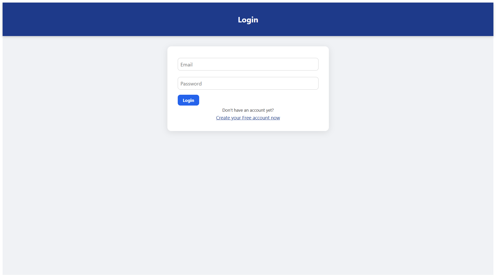
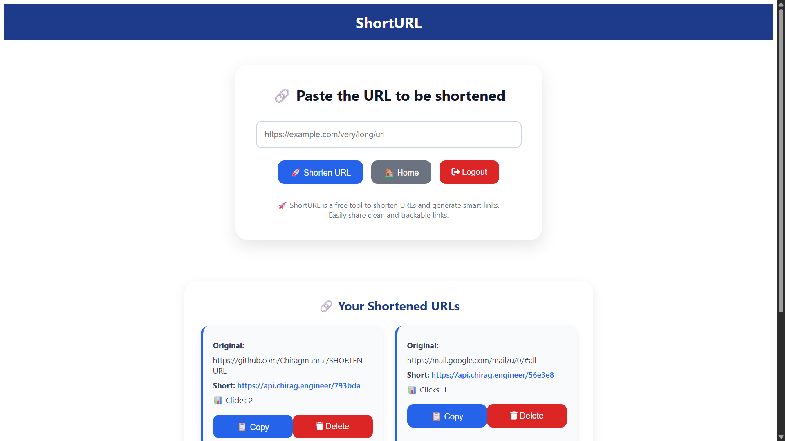

# 🔗 Shorten URL

A minimal and efficient **URL Shortening Application** built with the **MEAN Stack (MongoDB, Express, Angular, Node.js)**.  
It allows users to **create short links**, manage them easily, and **track analytics like click counts and creation dates** — all with a clean, responsive interface.

🚀 Deployed live: [Shorten URL](https://www.chirag.engineer/login)  
🔗 Backend API: [Render Server](https://api.chirag.engineer)

---

## ✨ Features
- 🔐 **User Authentication** (Signup & Login with JWT)
- 🔗 **Shorten Long URLs** into compact, shareable links
- 📊 **Track Analytics** — total clicks & created date
- 🗑️ **Delete Links** when no longer needed
- 🎨 **Modern Angular UI** with responsive design
- ☁️ **Full Deployment**: Frontend on Vercel, Backend on Render

---

## 🔐 Session Limitation
**⚠️ Important: This application supports only one active device/session per user at a time.**

- When you log in on a **new device (or browser tab), the old session’s refresh token becomes invalid.**

- This ensures **higher security**, but it also means **you will be logged out automatically from your previous device when logging in somewhere else.**

---

## 📸 Screenshots
| Login Page | Dashboard |
|-------------|------------|
|  |  |

---

## 📽 Demo Video
👉 [Watch the Demo](https://www.youtube.com/watch?v=1p_k6Rkl2lU)

---

## 🛠 Tech Stack
- **Frontend**: Angular, TypeScript  
- **Backend**: Node.js, Express  
- **Database**: MongoDB (Atlas)  
- **Authentication**: JWT + Refresh Tokens  
- **Deployment**: Vercel (Client) + Render (Server)

<p align="center">
  
  
  
  
  
  
  
</p>

---

## Contributing

Any kind of contributions are welcome.
  1. **Fork** the repo on GitHub.
  2. **Clone** the project to your own machine by following the below given steps of installation.
  3. **Commit** changes to **development** branch.
  4. **Push your work** back up to your fork.
  5. Submit a **Pull request** so that I can review your changes and after successfully reviewing your changes, I will **merge your pull request if it has some meaningful code**.
  6. Be happy, but **please don't just update the readme file**.
---

## ⚙️ Installation (Local Development)

```bash
# Clone the repository
git clone https://github.com/Chiragmanral/SHORTEN-URL
cd SHORTEN-URL

# Setup Backend
cd server
npm install
npm start

# Setup Frontend
cd ../client
npm install
ng serve -o

```
---

Important Note - Now your frontend will be running on http://localhost:4200
 in your browser, and your backend API will be running on http://localhost:8000
, but your frontend will be hitting the live API by default.
So, if you want to run this project fully on your local system, then replace all the live API links (https://api.chirag.engineer
) to http://localhost:8000
 in your frontend code.

Bonus tip :- You can use nodemon server.js instead of npm start (node server.js) to run your backend locally at the time of development.

## 🧠 Future Enhancements
- 📈 Advanced analytics (country, device, referrer)

- 📦 Custom alias support

- 🔒 Password-protected short links

- 📱 Progressive Web App (PWA) support

## License

This project is licensed under the MIT License.
Feel free to use, modify, and distribute.

## 🙌 Acknowledgements

Inspired by Bitly, TinyURL and other URL shortening tools

Thanks to my friends, supportersa and open-source libraries that made this possible.